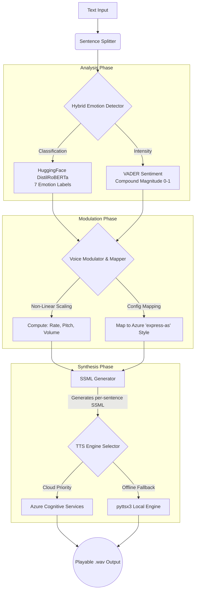

# 🧠 The Empathy Engine: Giving AI a Human Voice 🎙️

In the world of AI-driven interaction, the subtle vocal cues that build trust and rapport are often lost to the "uncanny valley" of standard, robotic Text-to-Speech (TTS) systems. **The Empathy Engine** bridges this gap. 

It is a powerful API and web service that dynamically modulates the vocal characteristics of synthesized speech based on the detected emotion and intensity of the source text—moving beyond monotonous delivery to achieve genuine emotional resonance.


---

## ✨ Achieving the Challenge Objectives

### ✔️ Core Functional Requirements (Must-Haves)
1. **Text Input:** The service accepts text strings via an elegant Web UI, a REST API endpoint (`/api/synthesize`), and a Command Line Interface (CLI).
2. **Emotion Detection:** A hybrid approach classifies text into **7 distinct emotions** (Joy, Sadness, Anger, Fear, Surprise, Disgust, and Neutral).
3. **Vocal Parameter Modulation:** The engine programmatically alters **Rate**, **Pitch**, and **Volume** based on the detected emotion.
4. **Emotion-to-Voice Mapping:** A highly tunable configuration file (`emotion_config.yaml`) governs the mapping logic between the emotion and the precise vocal adjustments.
5. **Audio Output:** Returns a playable `.wav` file, streamed directly to the browser or saved locally.

### 🌟 Bonus Objectives & Stretch Goals (Wow Factors!)
- **Granular Emotions:** Went beyond Positive/Negative/Neutral using a HuggingFace `distilroberta-base` model trained explicitly on 7 nuanced emotional states.
- **Intensity Scaling:** Integrated `VADER` sentiment analysis to calculate the *magnitude* of emotion (0.0 to 1.0). The engine uses **non-linear intensity scaling**—for instance, a highly angry statement modulates pitch, rate, and styledegree exponentially more than a mildly annoyed statement.
- **Per-Sentence Emotional Analysis for Paragraphs:** Unlike typical TTS engines that apply one flat emotion to an entire block of text, this engine splits paragraphs into individual sentences. It detects the specific emotion per sentence and wraps each one in varying XML/SSML tags dynamically before synthesis. This allows the voice to continuously shift in tone, volume, and speed as it speaks.
- **SSML Integration:** Utilizes advanced Speech Synthesis Markup Language (SSML) to natively pass prosody (rate, pitch, volume) and `express-as` emotional style tags directly to Azure's Neural TTS. 
- **Web Interface:** Built a beautiful, premium dark-mode UI with **FastAPI**, featuring a **WaveSurfer.js** audio visualizer and a **Chart.js** radar chart showing the exact emotional probability distribution of the text.
- **Hybrid TTS Engine:** Cloud-first processing using highly expressive Azure Neural Voices, with an automatic, graceful offline fallback to `pyttsx3` if cloud credentials are not provided.

---

## 🏗️ Architecture & System Diagram

The Empathy Engine uses a deeply modular pipeline designed for speed and flexibility:



### Pipeline Modules

| Module | File | Implementation Details |
|--------|------|------------------------|
| **Emotion Detector** | `emotion_detector.py` | Runs NLTK tokenization to split sentences. Evaluates VADER (intensity) + HuggingFace (label) on each sentence. |
| **Voice Modulator** | `voice_modulator.py` | Reads `emotion_config.yaml`. Applies formulas like `Base + (Intensity^1.5 * Range)` for natural, dynamic prosody scaling. |
| **SSML Generator** | `ssml_generator.py` | Crafts valid XML. Joins multiple sentences with `<break time="200ms"/>` so paragraphs sound natural. |
| **TTS Engine** | `tts_engine.py` | Handles async requests to Azure. Automatically falls back to local engine on network failure or missing keys. |
| **API Server** | `main.py` | FastAPI application serving REST endpoints, HTML templates, and CLI endpoints. |

---

## 🎭 Emotion Mapping Logic

The mapping is entirely configurable via `emotion_config.yaml`. The logic blends two layers:
1. **Azure Neural Styles (`express-as`):** Leverages Microsoft's pre-trained emotional variants across 6 styles.
2. **Prosody Adjustments:** Fine-tunes the speech using dynamic modifications.

*Example Mapping Formulas:*
- `scaledIntensity = raw_intensity ^ 1.5` (Ensures low intensity remains subtle, high intensity becomes dramatic).
- `Azure StyleDegree = 0.5 + (scaledIntensity * 1.5)` (Capped at 2.0).

| Emotion | Emotion Label | Prosody Adjustments at Max Intensity | Azure Style |
|---------|---------------|--------------------------------------|-------------|
| 😃 **Joy** | `joy` | Fast (+50 WPM), High (+0.5st), Loud (1.30×) | `cheerful` |
| 😢 **Sadness**| `sadness` | Slow (−40 WPM), Low (−0.5st), Soft (0.65×) | `sad` |
| 😡 **Anger** | `anger` | Fast (+60 WPM), High (+0.5st), Loud (1.50×) | `angry` |
| 😨 **Fear** | `fear` | Slightly Fast (+25 WPM), (+0.3st), Medium (0.85×) | `terrified` |
| 😲 **Surprise**| `surprise`| Fast (+35 WPM), High (+0.5st), Loud (1.30×) | `excited` |
| 🤢 **Disgust** | `disgust` | Slow (−20 WPM), Low (−0.3st), Medium (0.75×) | `angry` |
| 😐 **Neutral** | `neutral` | Default (175 WPM), (0st), Default (1.0×) | *None* |

*(Note: Pitch changes are programmatically clamped to a minimal ±0.5 semitones to avoid robotic squeaks, focusing the emotional weight on phrasing style, speed, and volume).*

---

## 🚀 Setup & Run Instructions

### Prerequisites
- Python 3.10+
- (Optional but Recommended) Windows OS for native `pyttsx3` fallback support.

### 1. Installation

Clone or extract the repository, then install dependencies:
```bash
cd CHALLENGE1
pip install -r requirements.txt
```
*(Note: On the first run, HuggingFace will automatically download the ~328MB `distilroberta` model.)*

### 2. Configuration (Azure TTS)
To hear the incredibly expressive voices, an Azure Speech key is recommended.
```bash
cp .env.example .env
```
Edit `.env` and add your Azure Speech Key and Region. 
*(If you skip this step, the engine will automatically fall back to standard `pyttsx3` voices).*

### 3. Run the Web Interface
Start the FastAPI server:
```bash
python -m app.main
```
Navigate your browser to: **[http://127.0.0.1:8000](http://127.0.0.1:8000)**

### 4. Run in CLI Mode
You can test the engine directly from the command line without starting the server:
```bash
python -m app.main --cli "I am absolutely furious about this situation!"
python -m app.main --cli "I am so incredibly happy today! But yesterday I was really sad."
```

---

## 🌐 API Overview

The service can be easily integrated into any backend via standard REST API.

| Method | Endpoint | Description |
|--------|----------|-------------|
| `GET` | `/` | Serves the interactive Web UI |
| `POST` | `/api/synthesize` | Full text → emotion → prosody → TTS pipeline |
| `POST` | `/api/batch` | Batch process an array of text strings |
| `GET` | `/api/audio/{filename}`| Serve generated `.wav` audio files |

*Example API Request:*
```bash
curl -X POST http://127.0.0.1:8000/api/synthesize \
  -H "Content-Type: application/json" \
  -d '{"text": "I am so happy today!"}'
```

*Response Payload Example:*
Returns the full breakdown of detected emotion probabilities, computed voice parameters, and the generated media URL for instant playback.
